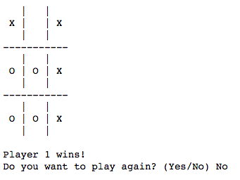

# Tic-Tac-Toe

## Installation

To play the game, download `tic-tac-toe.py` and save it on whatever destination you wish to have it on. For Mac, run your Terminal, go to the file destination where you saved it, and run the command `python tic-tac-toe.py`. For Windows, it is the same procedure, but find `cmd` in your search, run it and repeat the process